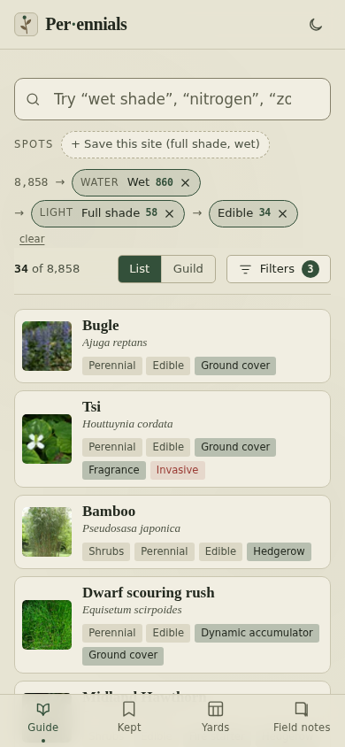

# Perennials

A field guide to over 8,800 useful plants that you search by constraint: the conditions of your site, then what you want the plant to do. Each pick narrows the list, and every option shows a live count of the plants it would still reach. It is a React, TypeScript and Vite web app that installs on a phone and works offline, backed by a Node and Postgres API that pulls open plant data. A yard sketcher places plants on a plan, an elevation and a 3D model.

**Status: shipping.** The plant records come from three open sources and are not reviewed or corrected here.

Live: https://ampactor.dev/perennials/



## Quick start

```sh
npm ci
npm run dev
```

Vite prints the local URL, http://localhost:5173/perennials/ unless that port is taken. The guide fetches its dataset from the hosted API, so the first load needs a network connection. Type `wet shade` in the search bar and pick the suggestion that combines both constraints to watch the list narrow.

To build and serve the production bundle:

```sh
npm run build    # typecheck, then production build into dist/
npm run preview  # serve dist/
```

To point the app at a different backend, set `VITE_DATA_API` at build time. `vite.config.ts` reads the same variable for the service worker's cache rules, so offline caching follows it. The API has its own commands and needs Postgres; see [server/README.md](server/README.md).

## Usage

Everything starts from the search bar. Type a condition (`wet shade`, `zone 6`), a use (`nitrogen`) or a plant name, common or scientific, and pick from the suggestions. A hardiness zone is a USDA band of average winter minimum temperature, and a plant hardy in zone 6 survives winters there. Each pick adds a step to the trail above the results, and any step can be removed. The facet rail, the filter panel beside the results, offers the same constraints as lists with live counts. The search lives in the URL, so https://ampactor.dev/perennials/?water=Wet&light=Full+shade&edible=1 opens that search directly.

The other views:

- **Guild** stacks the same results by forest-garden layer, from tall trees down to roots.
- **Plant pages** show the photo, attributes, native range, flower visitors, bloom, companions and any caution in the source's own words.
- **Kept** is your saved list, with a bloom wheel across the year.
- **Yards** sketch a real plot. Place plants on the plan, then view it as an elevation or a 3D model. Given your latitude and roughly how many metres the sheet spans, it computes each bed's hours of direct sun and can open the guide filtered to that light.
- **Field notes** shows how much of the data is filled in, and exports or restores your own notes, marks and photos.
- **`/annual`** lays out a year of your record for the browser's print-to-PDF.

The full tour is in [docs/FEATURES.md](docs/FEATURES.md).

## How it works

The project has three parts.

- **The app** (`src/`): React 18, TypeScript and Vite. It fetches three JSON files (plants, facets, meta) from the API and runs all search and filtering in the browser. MiniSearch, a small full-text search library, builds the name index when the browser is next idle. Faceted filtering and the live counts are one in-memory pass over the catalogue per interaction (`src/lib/query.ts`).
- **The service worker**: `vite-plugin-pwa` (Workbox) precaches the app shell and caches the data and photos as they load, so after one visit the guide works with no signal.
- **The API** (`server/`): a Node service on Postgres, hosted on Railway. It pulls, normalizes and enriches the data, serves it as brotli-compressed JSON, and resizes photos. See [server/README.md](server/README.md).

three.js draws the yard's 3D model. It ships as a separate chunk that loads only when a Model view opens, and the service worker precaches it so the model works offline. In `npm run build` on 2026-09-26 the main bundle was 108 KB gzipped and the model chunk 143 KB gzipped.

### Missing values

One rule shapes both the data model and the interface: a missing value is never shown as a fact. A field the sources did not fill reads "not in our sources", which is a statement about this guide's data. A plant with no recorded flower visitor says "No visitor in our sources." Cautions appear in the source's exact words, because "Toxic" and "Toxic fruits" mean different things to someone standing over an asparagus bed. A facet with partial data prints its coverage for the current results.

Your own values are stored beside the sources' values. `Plant` (`src/data/model.ts`) holds exactly what the API sent, and your values ride in `Dataset.mine`. `ACCESS` in `src/lib/query.ts` is the one place the guide reads a plant's fields, so your values filter, count and sort the same way a source's do. They always render in sepia and never carry a source's name.

### Where your data lives

Everything you write stays on your device: the kept list, notes, bloom marks, spots, yards, filled-in values and photos. It lives in eight `perennials.*.v1` keys in `localStorage` and one IndexedDB database, `perennials-photos`. There is no account or server-side copy, so the backup file is how you move your data between devices. Field notes saves a `.json` that restores every store, photos included, and a plain-text `.txt` copy. Restore merges by default, and the newer entry wins for each item.

Updates never touch this data. The service worker uses `registerType: "autoUpdate"`: a new version downloads in the background and the page reloads once to pick it up. Workbox only clears its own Cache Storage. Store keys are never renamed, and new fields are added as optional fields under the same `.v1` keys.

### Design

The look is a hand-built CSS design system modelled on a herbarium specimen catalogue, in light and dark themes. Its one rule, stated in `src/styles/tokens.css`: saturated colour only encodes plant data (bloom swatches, function tags), and the rest of the interface stays ink-on-paper monochrome.

## Data

| Source                                                | Supplies                                                   | Licence               |
| ----------------------------------------------------- | ---------------------------------------------------------- | --------------------- |
| [Permapeople](https://permapeople.org)                | The plants, descriptions, photos and most attributes       | CC BY-SA 4.0          |
| [GloBI](https://www.globalbioticinteractions.org)     | Flower visitors, from published field observations         | CC BY 4.0             |
| [USDA PLANTS](https://plants.usda.gov)                | Bloom colour and bloom period, for North-American species  | Public domain         |
| You                                                   | Notes, bloom dates you saw, photos, heights, filled blanks | Stays in your browser |

The four lanes never mix. Source values are never edited, and your values are never attributed to a source. That separation is also the licence boundary: what you write is yours and is not CC BY-SA.

Coverage in the live API on 2026-09-26 (8,858 plants, data generated 2026-09-23):

| Field                  | Plants with a value | Share |
| ---------------------- | ------------------: | ----: |
| Hardiness zone         |               6,012 |   68% |
| Photo                  |               4,784 |   54% |
| Flower visitors        |               3,786 |   43% |
| Alternate common names |               3,465 |   39% |
| Bloom colour           |               1,043 |   12% |
| Caution text           |                 794 |    9% |

Catalogue-wide numbers undersell a source like USDA, which covers North-American plants. For plants hardy in zone 6 and native to New York, bloom colour covers 237 of 613 (39%), so the facet rail reports coverage for the current results. [docs/DATA.md](docs/DATA.md) has the script behind these counts, and notes on the transform, photos and download size.

The dataset is not committed to this repo. The API re-pulls Permapeople weekly and keeps the enrichment it already has. Every hour it re-verifies the five stalest plants against GloBI and USDA, which cycles all 8,858 plants in about 74 days. The Permapeople API key lives only in the API's environment.

## Project layout

```
src/data/       model (types), store (fetch, cache, lazy name index, your
                values folded into the dataset)
src/lib/        query (facets, one-pass evaluation, live counts), constraints
                (search atoms and the URL codec), suggest (the search bar's
                grammar), spots, bloom, img, hardiness, homeZone, today, paper;
                your data: mine, notes, seen, kept, photos, backup, latitude,
                phenology; the yard: yards, elevation, ground, growth, sun,
                yardViews, yardExport, yardFile
src/state/      search (constraints in; results, counts and trail out)
src/components/ Omnibox, Trail, FacetRail, SpotBar, ResultGrid, PlantCard,
                GuildView, Today, Thumb, Layout, InstallHint; the yard:
                YardCanvas, ElevationView, YardModel, YearScrubber; your data:
                AddMine, NotePanel, BloomCalendar, SeenMark, BackupPanel
src/pages/      Browse, Plant, Kept, Yards, Yard, Annual, About
src/styles/     tokens, base, app, browse, detail, kept, yard, annual
server/         the data API: pull, transform, enrich, ingest, resize, serve
docs/           feature tour and data notes
```

## Deploy

The front end deploys to GitHub Pages at https://ampactor.dev/perennials/ on every push to `main`. `.github/workflows/deploy.yml` runs `npm ci`, `npm test` and `npm run build`, then publishes `dist/`. The build copies `index.html` to `404.html` so that deep links load on GitHub Pages.

The API deploys to Railway from the repository root:

```sh
railway up --service api
```

The Railway CLI uploads the whole git repository whatever the working directory. Run from `server/`, it still uploads the root, Nixpacks (Railway's builder) finds the Vite app at the top level, and a static site replaces the API. `railway.json` at the root pins the build to `server/` so that cannot happen. [server/README.md](server/README.md) lists the API's environment variables.

## Testing

```sh
npm test            # vitest, all tests in src/lib/rules.test.ts
npm run typecheck   # tsc -b --noEmit
```

`npm test` on 2026-09-26:

```
 Test Files  1 passed (1)
      Tests  76 passed (76)
```

Typecheck with `npm run typecheck`. `tsconfig.json` is a solution-style config (`"files": []` plus project references), so a bare `tsc --noEmit` compiles nothing and exits 0 even when the code is broken.

The tests cover the rules the guide depends on:

- what a hardiness record means (a lone zone number is a floor), and that a plant with no measurement never ranks below one the record rules out;
- how USDA's bloom periods land on nine season slots, and that "in bloom now" never counts a plant with no record;
- that your values reach filters, counts and coverage through `ACCESS` without taking a source's name;
- the yard: figures only for measured heights, growth as a band, the computed sun and shade, and ground that passes exactly through your spot heights;
- that a backup merge or a yard-file import never loses or overwrites your entries;
- that flower-visitor and guild-layer gap lines are never read out of missing records.

They exist because reading a lone hardiness number as a one-zone window dropped Red mulberry and hardy kiwi out of zone-6 searches for months, and nothing caught it.

CI: `.github/workflows/ci.yml` runs `npm run typecheck` and `npm test` on pull requests. The deploy workflow runs the tests and the build (which typechecks) on every push to `main`, so a failing test stops the deploy.

Not tested: `evaluate` in `src/lib/query.ts` (the filter pass, counts and trail) has no direct test, the React components and pages have none, and the API in `server/` has none. Nothing checks the data itself, so a Permapeople field going empty upstream goes unnoticed.

## Limitations

None of the plant data is mine. Records come from Permapeople, flower visitors from GloBI and bloom colour from USDA PLANTS, and their completeness varies plant by plant. A constraint search is only as good as the tags underneath it, so a plant with a missing tag is invisible to the filter that should have found it. The guide does not check invasiveness or whether a plant is legal to grow where you live, so check with your local extension office before you buy anything.

- 2,846 plants (on 2026-09-26) have no recorded hardiness zone, and any zone search sets them aside. The rail says how many.
- There is no way to exclude a caution, such as "nothing invasive". See Roadmap.
- Your data lives in one browser. Safari can clear a site's storage after about a week without a visit, though an app installed to the home screen is exempt. The app asks for persistent storage on your first write, and the backup file is the only copy outside the browser.
- Accounts and sync are left out by design. Moving to another device means exporting and importing a file.

## Roadmap

- **A negation constraint**, so "nothing invasive" can be asked. Cautions are recorded for only 794 of 8,858 plants, so a "without invasive" filter would pass about 8,000 plants that nobody assessed. Better caution data has to come first.
- **Flower colour for more plants.** Permapeople has no such field, and USDA records it for 1,043 plants. Wikidata has no flower-colour statement for yarrow, comfrey or bee balm (checked 2026-09-26). The information lives in prose, in floras and in Kew's descriptions, and I have not found an open structured dataset for it at global scale.

## License

No license chosen yet. The plant data keeps its sources' licences, listed under [Data](#data).
